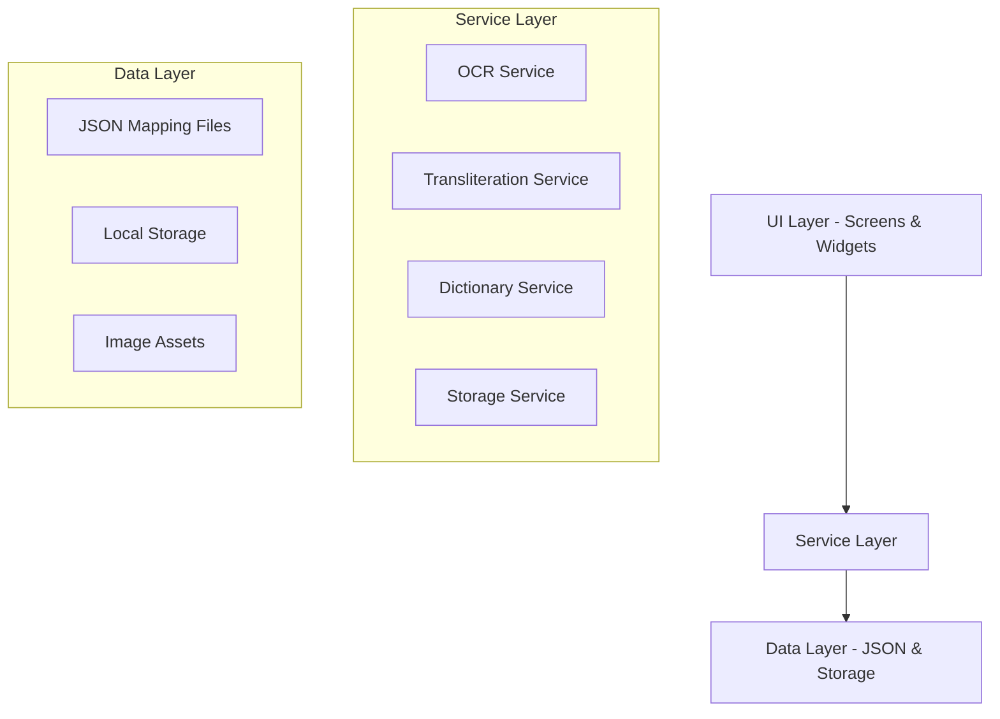

# Design Document

## Overview

Bali Lontar is a Flutter-based mobile application that provides OCR, transliteration, and translation capabilities for Aksara Bali and Aksara Kawi scripts. The application follows a clean architecture pattern with clear separation between UI, business logic, and data layers. All core functionality operates offline using local datasets and processing, ensuring usability in remote locations without internet connectivity.

The application uses a service-oriented architecture where each major capability (OCR, transliteration, translation, storage) is encapsulated in an independent service. This design enables maintainability, testability, and future extensibility.

## Architecture

### High-Level Architecture



### Layer Responsibilities

**UI Layer (lib/screens, lib/widgets)**
- Presents information to users
- Captures user input and gestures
- Delegates business logic to services
- Manages navigation and state
- Implements Material Design 3 guidelines

**Service Layer (lib/services)**
- Implements core business logic
- Processes images and text
- Manages data transformations
- Provides clean interfaces to UI layer
- Handles error conditions gracefully

**Data Layer (lib/data, assets)**
- Stores mapping and dictionary data in JSON format
- Manages persistent storage of user results
- Provides data access interfaces
- Handles file I/O operations

### Technology Stack

- **Framework**: Flutter 3.x (Dart)
- **State Management**: Provider or Riverpod for dependency injection
- **Image Processing**: image package for preprocessing
- **OCR**: Custom character recognition with pattern matching (mock implementation for MVP)
- **Storage**: sqflite for local database, shared_preferences for settings
- **PDF Generation**: pdf package
- **File Handling**: path_provider, file_picker, image_picker
- **UI**: Material Design 3 components

## Components and Interfaces

### 1. OCR Service

**Purpose**: Converts images of Aksara Bali and Aksara Kawi scripts into digital text.

**Interface**:
```dart
class OCRService {
  Future<OCRResult> processImage(File imageFile, ScriptType scriptType);
  Future<File> preprocessImage(File imageFile);
  Future<ScriptType> detectScriptType(File imageFile);
}

class OCRResult {
  String recognizedText;
  ScriptType scriptType;
  double confidence;
  List<CharacterBox> characterBoxes;
  File processedImage;
}

enum ScriptType { baliStandar, baliMurda, baliModre, kawi, unknown }
```

**Implementation Strategy**:

For the MVP, the OCR Engine will use a pattern-matching approach with pre-segmented character templates:

1. **Image Preprocessing Pipeline**:
   - Convert to grayscale using luminosity method
   - Apply adaptive Gaussian thresholding (block size: 11, C: 2)
   - Morphological operations to remove noise (erosion + dilation)
   - Detect and correct rotation using Hough line transform
   - Normalize contrast using histogram equalization

2. **Character Segmentation**:
   - Detect connected components using flood fill
   - Filter components by size (remove noise)
   - Sort components left-to-right, top-to-bottom
   - Extract bounding boxes for each character

3. **Character Recognition**:
   - Resize extracted character to standard size (64x64)
   - Compare against template database using normalized cross-correlation
   - Apply threshold for minimum confidence (0.75)
   - Return best match with confidence score

4. **Post-Processing**:
   - Combine base characters with diacritics (sandangan)
   - Resolve pasangan (consonant conjuncts)
   - Apply script-specific rules for character combinations

**Character Template Database**:
- Store 200+ character templates for Aksara Bali (standar, murda, modre)
- Store 150+ character templates for Aksara Kawi
- Templates stored as normalized binary images
- Organized by script type and character category

### 2. Transliteration Service

**Purpose**: Converts text between different script systems (Bali ↔ Latin, Kawi ↔ Latin).

**Interface**:
```dart
class TransliterationService {
  Future<String> transliterate(String input, TransliterationMode mode);
  Future<List<TransliterationOption>> getAlternatives(String input, TransliterationMode mode);
  Future<void> loadMappings();
}

enum TransliterationMode {
  baliToLatin,
  latinToBali,
  kawiToLatin,
  latinToKawi,
  baliToIndo,
  kawiToIndo
}

class TransliterationOption {
  String result;
  String explanation;
  double confidence;
}
```

**Mapping Data Structure**:

```json
{
  "baseCharacters": {
    "ᬅ": "a",
    "ᬆ": "aa",
    "ᬇ": "i"
  },
  "consonants": {
    "ᬓ": "ka",
    "ᬔ": "kha",
    "ᬕ": "ga"
  },
  "pasangan": {
    "ᬓ᭄ᬓ": "kka",
    "ᬓ᭄ᬢ": "kta"
  },
  "sandangan": {
    "᭄": "virama",
    "ᬵ": "aa",
    "ᬶ": "i"
  },
  "numerals": {
    "᭐": "0",
    "᭑": "1"
  }
}
```

**Transliteration Algorithm**:

1. **Bali/Kawi to Latin**:
   - Tokenize input into character sequences
   - Check for multi-character patterns (pasangan) first
   - Apply sandangan modifications to base characters
   - Map each token to Latin equivalent
   - Apply phonetic rules for consonant clusters
   - Preserve word boundaries and punctuation

2. **Latin to Bali/Kawi**:
   - Tokenize input into syllables
   - Identify vowels and consonants
   - Map consonants to base characters
   - Apply vowel modifications using sandangan
   - Generate pasangan for consonant clusters
   - Handle special cases (final consonants, nasalization)

### 3. Dictionary Service

**Purpose**: Provides word-level translations between Balinese, Kawi, and Indonesian.

**Interface**:
```dart
class DictionaryService {
  Future<List<Translation>> translate(String word, String sourceLang, String targetLang);
  Future<List<Translation>> translatePhrase(String phrase, String sourceLang, String targetLang);
  Future<void> loadDictionaries();
  Future<List<String>> getSuggestions(String partial, String language);
}

class Translation {
  String word;
  String translation;
  String partOfSpeech;
  List<String> definitions;
  List<String> examples;
  double confidence;
}
```

**Dictionary Data Structure**:

```json
{
  "entries": [
    {
      "word": "anak",
      "translations": [
        {
          "language": "id",
          "text": "anak",
          "pos": "noun",
          "definitions": ["child", "offspring"],
          "examples": ["anak luh (daughter)", "anak muani (son)"]
        }
      ],
      "frequency": 950
    }
  ]
}
```

**Translation Algorithm**:

1. **Word Lookup**:
   - Normalize input (lowercase, trim)
   - Direct dictionary lookup
   - If not found, try stemming (remove affixes)
   - If still not found, try fuzzy matching (Levenshtein distance < 2)
   - Return all matches with confidence scores

2. **Phrase Translation**:
   - Tokenize phrase into words
   - Translate each word independently
   - Check for multi-word expressions in dictionary
   - Combine translations with proper word order
   - Flag untranslated words

3. **Context-Aware Selection**:
   - Use frequency data to rank translations
   - Consider part of speech for disambiguation
   - Provide multiple options when ambiguous

### 4. Storage Service

**Purpose**: Manages persistent storage of OCR results, translations, and user data.

**Interface**:
```dart
class StorageService {
  Future<String> saveResult(SavedResult result);
  Future<SavedResult?> getResult(String id);
  Future<List<SavedResult>> getAllResults({int limit, int offset});
  Future<void> deleteResult(String id);
  Future<void> deleteMultiple(List<String> ids);
  Future<List<SavedResult>> searchResults(String query);
  Future<File> exportToTxt(String id);
  Future<File> exportToPdf(String id);
}

class SavedResult {
  String id;
  DateTime timestamp;
  ResultType type;
  String sourceText;
  String resultText;
  ScriptType? scriptType;
  String? imagePath;
  Map<String, dynamic> metadata;
}

enum ResultType { ocr, transliteration, translation }
```

**Storage Implementation**:

1. **Database Schema** (SQLite):
```sql
CREATE TABLE results (
  id TEXT PRIMARY KEY,
  timestamp INTEGER NOT NULL,
  type TEXT NOT NULL,
  source_text TEXT NOT NULL,
  result_text TEXT NOT NULL,
  script_type TEXT,
  image_path TEXT,
  metadata TEXT
);

CREATE INDEX idx_timestamp ON results(timestamp DESC);
CREATE INDEX idx_type ON results(type);
```

2. **File Storage**:
   - Images stored in app documents directory
   - Organized by date: `images/YYYY/MM/DD/`
   - Thumbnails generated at 200x200 for list views
   - Original images preserved for export

3. **Export Formats**:
   - **TXT**: Plain text with metadata header
   - **PDF**: Formatted document with optional image, metadata footer

## Data Models

### Core Data Models

```dart
// Character recognition result
class CharacterBox {
  Rect boundingBox;
  String character;
  double confidence;
  ScriptType scriptType;
}

// Mapping entry for transliteration
class MappingEntry {
  String source;
  String target;
  String category; // base, consonant, pasangan, sandangan
  List<String> alternatives;
}

// Dictionary entry
class DictionaryEntry {
  String word;
  String language;
  List<Translation> translations;
  int frequency;
  DateTime lastUpdated;
}

// User preferences
class AppSettings {
  bool darkMode;
  String defaultScriptType;
  bool autoDetectScript;
  double ocrConfidenceThreshold;
  String exportFormat;
}
```

### JSON Data Files

**1. bali_mapping.json** (~50KB)
- Complete Aksara Bali character set
- Pasangan combinations
- Sandangan diacritics
- Numerals and punctuation
- Bidirectional mappings (Bali ↔ Latin)

**2. kawi_mapping.json** (~35KB)
- Aksara Kawi character set
- Kawi-specific variants
- Bidirectional mappings (Kawi ↔ Latin)

**3. dictionary_bali_id.json** (~500KB)
- 5,000+ Balinese-Indonesian word pairs
- Common phrases and expressions
- Part of speech tags
- Usage examples
- Frequency rankings

**4. dictionary_kawi_id.json** (~300KB)
- 3,000+ Kawi-Indonesian word pairs
- Archaic terms with modern equivalents
- Sanskrit loanwords
- Etymology information

## Error Handling

### Error Categories

1. **Image Processing Errors**:
   - Invalid image format → Show format requirements
   - Image too large → Resize automatically
   - Image too small → Warn about accuracy
   - Preprocessing failure → Use original image

2. **OCR Errors**:
   - No text detected → Suggest better lighting/angle
   - Low confidence → Show confidence scores, allow manual correction
   - Script detection failure → Allow manual script selection

3. **Transliteration Errors**:
   - Unknown character → Mark as [?], continue processing
   - Ambiguous mapping → Provide alternatives
   - Invalid input → Show format requirements

4. **Translation Errors**:
   - Word not in dictionary → Return original word
   - Multiple meanings → Show all options
   - Phrase too complex → Translate word-by-word

5. **Storage Errors**:
   - Disk full → Prompt to delete old results
   - Database corruption → Attempt recovery, backup data
   - Export failure → Retry with different format

### Error Handling Strategy

```dart
class AppError {
  ErrorType type;
  String message;
  String userMessage;
  dynamic originalError;
  StackTrace? stackTrace;
  
  bool get isRecoverable;
  String get recoveryAction;
}

enum ErrorType {
  imageProcessing,
  ocr,
  transliteration,
  translation,
  storage,
  network,
  unknown
}
```

All services will:
- Return Result<T, AppError> types for operations that can fail
- Log errors for debugging
- Provide user-friendly error messages
- Suggest recovery actions
- Never crash the app

## Testing Strategy

### Unit Testing

**OCR Service Tests**:
- Image preprocessing correctness
- Character segmentation accuracy
- Template matching algorithm
- Script type detection
- Confidence score calculation

**Transliteration Service Tests**:
- Character mapping correctness
- Pasangan handling
- Sandangan application
- Bidirectional conversion consistency
- Edge cases (empty input, special characters)

**Dictionary Service Tests**:
- Word lookup accuracy
- Phrase translation
- Fuzzy matching
- Stemming algorithm
- Multiple translation handling

**Storage Service Tests**:
- CRUD operations
- Search functionality
- Export format correctness
- Data integrity
- Concurrent access handling

### Integration Testing

- End-to-end OCR flow: image → preprocessed → recognized → transliterated
- Complete translation pipeline: OCR → transliteration → translation
- Save and retrieve workflow
- Export functionality with various formats
- Cross-service data flow

### Widget Testing

- Screen navigation
- User input handling
- Result display
- Error message presentation
- Loading states
- Button interactions

### Test Data

- Sample lontar images (10+ images)
- Known text samples for each script type
- Edge cases: damaged text, unclear images, mixed scripts
- Dictionary test cases with known translations
- Performance test data (large images, long texts)

## UI/UX Design

### Design Principles

1. **Cultural Authenticity**: Use Balinese-inspired color palette and visual elements
2. **Clarity**: Clear typography, high contrast, readable fonts
3. **Efficiency**: Minimize taps to complete tasks
4. **Feedback**: Immediate visual feedback for all actions
5. **Accessibility**: Support for screen readers, adjustable text sizes

### Color Palette

```dart
// Balinese-inspired colors
const primaryColor = Color(0xFF8B4513); // Saddle Brown (lontar)
const secondaryColor = Color(0xFFD4AF37); // Gold (temple accents)
const accentColor = Color(0xFF2E7D32); // Green (nature)
const backgroundColor = Color(0xFFFAF3E0); // Cream (palm leaf)
const surfaceColor = Color(0xFFFFFFFF); // White
const errorColor = Color(0xFFB71C1C); // Red
```

### Screen Layouts

**1. Home Screen**
- Welcome message with app description
- Four main action cards:
  - Scan & OCR
  - Transliterate Text
  - Translate Text
  - View History
- Quick stats: total scans, saved results
- Settings icon in app bar

**2. OCR Screen**
- Camera/gallery selection buttons
- Image preview area
- Process button
- Results display:
  - Original image (zoomable)
  - Recognized text (selectable)
  - Confidence indicator
  - Action buttons: Save, Transliterate, Translate, Share, Export

**3. Transliteration Screen**
- Input method selector (Type/Paste/From OCR)
- Source script selector (Bali/Kawi/Latin)
- Target script selector
- Input text area
- Transliterate button
- Results display with alternatives
- Action buttons: Save, Translate, Share, Copy

**4. Translation Screen**
- Input method selector
- Language pair selector (Bali-ID, ID-Bali, Kawi-ID)
- Input text area
- Translate button
- Results display with word-by-word breakdown
- Action buttons: Save, Share, Copy

**5. History Screen**
- List view with cards for each result
- Filter by type (OCR/Transliteration/Translation)
- Search bar
- Sort options (date, type)
- Swipe to delete
- Tap to view details
- Batch selection mode for multi-delete

### Navigation Structure

```
TabBar (Bottom Navigation)
├── OCR
├── Transliterate
├── Translate
└── History

AppBar (Top)
├── Title
├── Search (on History)
└── Settings
```

### Animations & Transitions

- Page transitions: Slide animation (300ms)
- Button press: Scale down to 0.95 (100ms)
- Loading: Circular progress with fade-in
- Result appearance: Fade + slide up (400ms)
- Error messages: Shake animation (500ms)

### Typography

```dart
// Text styles
final headlineStyle = TextStyle(
  fontSize: 24,
  fontWeight: FontWeight.bold,
  color: primaryColor,
);

final bodyStyle = TextStyle(
  fontSize: 16,
  color: Colors.black87,
);

final scriptStyle = TextStyle(
  fontSize: 20,
  fontFamily: 'Noto Sans Balinese', // For Aksara Bali
  color: Colors.black,
);
```

## Performance Considerations

### Optimization Strategies

1. **Image Processing**:
   - Resize large images to max 2048x2048 before processing
   - Use isolates for CPU-intensive operations
   - Cache preprocessed images
   - Lazy load thumbnails in history view

2. **OCR**:
   - Limit character template comparisons using spatial indexing
   - Process image in tiles for large documents
   - Use confidence threshold to skip unlikely matches
   - Implement early termination for high-confidence matches

3. **Data Loading**:
   - Load JSON mappings once at app startup
   - Use lazy loading for dictionary entries
   - Index dictionary by first letter for faster lookup
   - Cache frequently accessed translations

4. **Storage**:
   - Paginate history results (20 items per page)
   - Use database indexes for search queries
   - Compress images before storage (JPEG quality 85)
   - Implement automatic cleanup of old results (configurable)

5. **UI Responsiveness**:
   - Show loading indicators for operations > 200ms
   - Use debouncing for search input (300ms)
   - Implement pull-to-refresh with haptic feedback
   - Optimize list rendering with ListView.builder

### Memory Management

- Dispose image resources after processing
- Clear cached data when memory warning received
- Limit in-memory result cache to 50 items
- Use weak references for large objects

### Battery Optimization

- Avoid continuous camera preview when not needed
- Batch database writes
- Minimize wake locks
- Use efficient image formats (WebP where supported)

## Security & Privacy

### Data Protection

1. **Local Storage Only**:
   - All data stored on device
   - No cloud sync or external transmission
   - User controls all data deletion

2. **Permissions**:
   - Camera: Required for OCR
   - Storage: Required for image selection and export
   - No network permissions needed

3. **Data Lifecycle**:
   - User can delete individual or all results
   - Exported files saved to user-accessible locations
   - No analytics or tracking

### Code Security

- Input validation for all user text
- Sanitize file paths to prevent directory traversal
- Limit file sizes to prevent DoS
- Handle malformed JSON gracefully

## Deployment & Distribution

### Build Configuration

**Android**:
- Minimum SDK: 21 (Android 5.0)
- Target SDK: 33 (Android 13)
- Permissions: CAMERA, READ_EXTERNAL_STORAGE, WRITE_EXTERNAL_STORAGE
- APK size target: < 50MB

**iOS**:
- Minimum version: iOS 12.0
- Permissions: Camera, Photo Library
- IPA size target: < 50MB

### Release Checklist

- [ ] All unit tests passing
- [ ] Integration tests passing
- [ ] UI tests on multiple screen sizes
- [ ] Performance profiling completed
- [ ] Memory leak detection
- [ ] Offline functionality verified
- [ ] Export formats validated
- [ ] Dictionary data accuracy checked
- [ ] OCR accuracy benchmarked
- [ ] User documentation complete

## Future Enhancements

### Phase 2 Features

1. **Advanced OCR**:
   - Machine learning model for improved accuracy
   - Support for handwritten text
   - Multi-column layout detection

2. **Enhanced Translation**:
   - Context-aware translation using language models
   - Grammar checking for Balinese text
   - Sentence-level translation

3. **Collaboration**:
   - Share custom dictionaries
   - Community corrections for OCR results
   - Collaborative translation improvements

4. **Additional Features**:
   - Text-to-speech for Balinese
   - Balinese keyboard input
   - Learning mode with flashcards
   - Historical text database

### Extensibility Points

- Plugin architecture for custom OCR engines
- API for third-party dictionary integration
- Export format plugins
- Custom preprocessing filters
